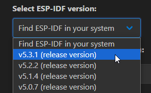
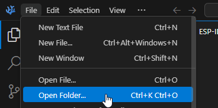
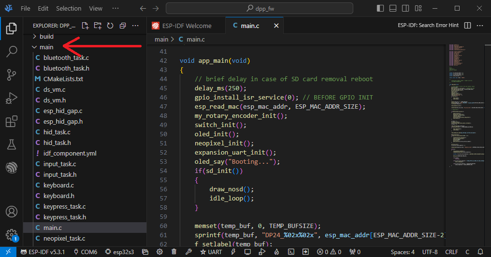
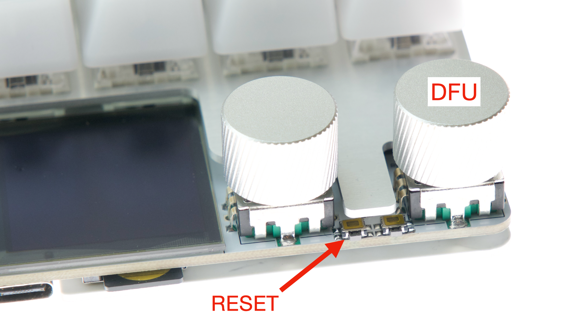
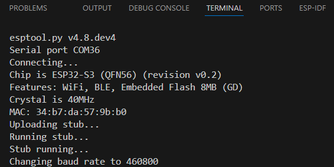

# duckyPad Pro Tinkering Guide

[Kickstarter Info](https://www.kickstarter.com/projects/dekunukem/duckypad-pro-advanced-macro-scripting-beyond-qmk-via) | [Official Discord](https://discord.gg/4sJCBx5) | [Getting Started](getting_started.md) | [Table of Contents](#table-of-contents)

-----------

This guide shows you how to delve deeper into duckyPad and make firmware modifications.

## Prerequisite

This is a fairly involved project with a lot of code, so knowledge and prior experience with MCUs would be very helpful.

* Arduino, PIC, STM32, etc
* Also RTOS Basics

## MCU Info

duckyPad Pro runs on [`ESP32-S3`](https://www.espressif.com/en/products/socs/esp32-s3) microcontroller:

* Dual-Core @ 240 MHz 
* 4MB Flash Memory
* 512KB RAM
* 2MB PSRAM
* Wi-Fi and Bluetooth

Compared to STM32F072 in the original duckyPad, this MCU is much more powerful and much easier to tinker with.

## Toolchain Options

There are a number of ways to program ESP32.

[PlatformIO](https://platformio.org/) is popular with beginners, but it has a lot of abstractions, bloat, and limited control.

[ESP-IDF](https://github.com/espressif/esp-idf), used by duckyPad Pro, is the official SDK with full API support, more libraries, and documentation.

## Install ESP-IDF

ESP-IDF uses Visual Studio Code.

I recommend [VSCodium](https://vscodium.com/), same thing but without tracking and telemetry.

Anyway, follow the [official setup guide](https://github.com/espressif/vscode-esp-idf-extension/blob/master/docs/tutorial/install.md) to install everything. 

It is very text-heavy, but follow the steps and it should work.

Make sure to select (at least) `ESP-IDF v5.3.1`:

## Download Repo

Clone the repo:

`git clone https://github.com/dekuNukem/duckyPad-Pro`

## Compile Firmware

In VSCode, select `File -> Open Folder...`

Go into `Firmware` folder, select the `dpp_fw` folder:

Expand `main` folder

All the sources file are there

To compile, press `CONTROL + E`, then `B` key.

It might take a while, but eventually it should finish.

## Upload Firmware

We want to put the ESP32 in DFU (Device Firmware Upload) mode.

* `HOLD DOWN` RESET button.
* `HOLD DOWN` DFU button, aka upper encoder knob.
* `RELEASE` RESET button.
* `RELEASE` DFU button.

If all goes well, the screen should stay blank.

We are now in DFU mode, and duckyPad shows up as a USB Serial device.

* Click the `COM` port number

* Select the duckyPad serial port, it should say `Microsoft`.

To upload, press `CONTROL + E`, then `F` key.

It should take a few seconds.

Press `RESET` button to start using new FW.

## Hardware Info

## Questions or Comments?

Please feel free to [open an issue](https://github.com/dekuNukem/duckypad-pro/issues), ask in the [official duckyPad discord](https://discord.gg/4sJCBx5), or email `dekuNukem`@`gmail`.`com`!

## Table of Contents

[Main page](../README.md)

[Getting Started Guide](getting_started.md)

[Kit Assembly Guide](kit_assembly.md)

[Using duckyScript](duckyscript_info.md)

[duckyScript VM](bytecode_vm.md)

[Tinkering Guide](tinkering_guide.md)

[Troubleshooting](troubleshooting.md)

[Firmware Update](fw_update.md)